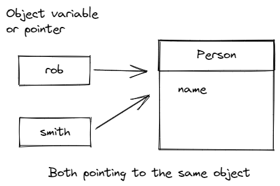

>[Common Home](../README.md)
 
# Book Notes
 
## Chapter 4

Constructors have the same name as the class.

Object variable is different to Object.

Two variables can point to the same object.

 
 `Date` class refers to a particular point in time

 `LocalDate` class refers to a particular calendar notation. Instances of this are created using `static factory methods`.

 
>[Common Home](../README.md)