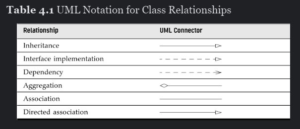
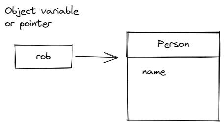

>[Common Home](../README.md)
 
# V1 Chapter 4 : Objects and Classes
 
## Status : DONE 
 
## Contents

In this chapter
* 4.1 Introduction to Object-Oriented Programming
* 4.2 Using Predefined Classes
* 4.3 Defining Your Own Classes
* 4.4 Static Fields and Methods
* 4.5 Method Parameters
* 4.6 Object Construction
* 4.7 Records
* 4.8 Packages
* 4.9 JAR Files
* 4.10 Documentation Comments
* 4.11 Class Design Hints

 
## Objects 

> The most common relationships between classes are
> * Dependence (“uses–a”)
> * Aggregation (“has–a”)
> * Inheritance (“is–a”)

> Constructors always have the same name as the class name. Thus, the constructor for the `Date` class is called `Date`.
 
Object variable is different to Object.

Two variables can point to the same object.

 
 `Date` class refers to a particular point in time

 `LocalDate` class refers to a particular calendar notation. Instances of this are created using `static factory methods`.

> The library designers decided to separate the concerns of keeping time and attaching names to points in time. Therefore, the standard Java library contains two separate classes: the Date class, which represents a point in time, and the LocalDate class, which expresses days in the familiar calendar notation. Java 8 introduced quite a few other classes for manipulating various aspects of date and time—see Chapter 6 of Volume II.

> You do not use a constructor to construct objects of the `LocalDate` class. Instead, use static factory methods that call constructors on your behalf. 
> The expression `LocalDate.now()` constructs a new object that represents the date at which the object was constructed. 
> You can construct an object for a specific date by supplying year, month, and day:
`LocalDate.of(1999, 12, 31)`

Try `getYear(), getMonth(), getDayOfMonth()` on `LocalDate` object.

Try `plusDays()` on `LocalDate` object.

The `NullPointerException` is a runtime exception that is thrown when you try to use a variable that does not refer to an object. Show `NullPointerException` 

> To share classes among programs, you need to do the following:
> 1. Place your class files inside a directory—for example, /home/user/classdir. Note that this directory is the base directory for the package tree. If you add the class com.horstmann.corejava.Employee, then the Employee.class file must be located in the subdirectory /home/user/classdir/com/horstmann/corejava.
> 2. Place any JAR files inside a directory—for example, /home/user/archives.
> 3. Set the class path. The class path is the collection of all locations that can contain class files

>Multi-release JARs are not intended for different versions of a program or library. The public API of all classes should be the same for both releases. The sole purpose of multi-release JARs is to enable a particular version of your program or library to work with multiple JDK releases. If you add functionality or change an API, you should provide a new version of the JAR instead.

## Class Design Hints

1. Always keep data private.
2. Always initialize data.
3. Don't use too many basic types in a class.
4. Not all fields need individual field accessors and mutators.
5. Break up classes that have too many responsibilities.
6. Make the names of classes and methods reflect their functionality.
   >  A good convention is that a class name should be a noun (Order), or a noun preceded by an adjective (RushOrder) or a gerund (an “-ing” word, as in BillingAddress). As for methods, follow the standard convention that accessor methods begin with a lowercase get (getSalary) and mutator methods use a lowercase set (setSalary).
7. Prefer immutable classes.
   > The problem with mutation is that it can happen concurrently when multiple threads try to update an object at the same time. The results are unpredictable. When classes are immutable, it is safe to share their objects among multiple threads.

>[Common Home](../README.md)