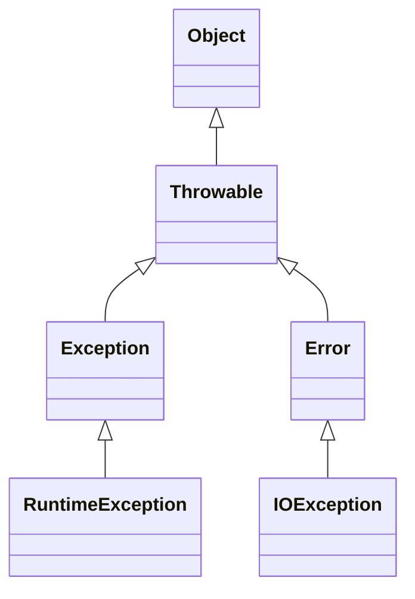
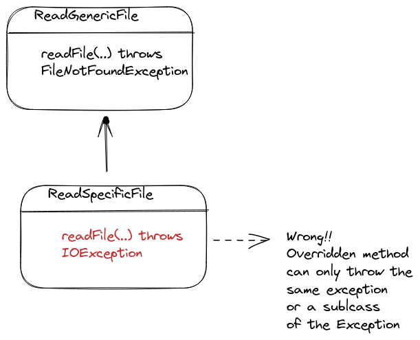

>[Home](Home.md)

# Chapter 7: Exceptions, Assertions, and Logging
Status : IN_PROGRESS 


We'll cover Exceptions, Assertions and Logging in this chapter.

In one line we can say that Exceptions are used to handle errors, Assertions are used to check for conditions that should never occur and Logging is used to record events that occur while a program is running.


## 7.1     Dealing with Errors

Errors can occur because of these reasons
- User input errors 
- Device/Network errors
- Resource errors - memory/disk space
- Programming errors

In traditional programming languages, errors are handled by returning error codes. For example, the C library function fopen returns a null pointer if the file cannot be opened. The caller of fopen must check the return value to see if the file was opened successfully. This approach is called error codes. The problem with error codes is that they are easy to forget. If you forget to check the return value, you may not notice that the file was not opened successfully.

Sometimes it is not possible to return an error code. For example, suppose you are writing a method that computes the square root of a number. If the number is negative, the method cannot return a value. What error code should it return? 

Java uses exceptions to handle errors. An exception is an object that represents an error. When an error occurs, the Java runtime system creates an exception object and hands it to the part of the program that is responsible for handling the error. The part of the program that handles the error is called an exception handler. The exception handler decides what to do with the exception. It can either handle the error or pass the exception to another exception handler. If the exception is not handled, the program terminates.

Note that the method exits at the point the exception is thrown, so no return value is needed.

Exceptions have a type. The type of an exception object indicates what went wrong. For example, if a file cannot be opened, the exception object has type FileNotFoundException. 

These have a type hierarchy which will be looked at next.

### 7.1.1 The Classification of Exceptions




The `Error` class is a subclass of `Throwable` that indicates serious problems that a reasonable application should not try to catch. Most such errors are abnormal conditions. The `ThreadDeath` class is a subclass of Error that indicates that a thread has exited.

The `Exception` class is a subclass of `Throwable` that indicates conditions that a reasonable application might want to catch. Checked exceptions are subclasses of `Exception` that must be caught by the code that calls the method. Unchecked exceptions are subclasses of `RuntimeException`. They are also called runtime exceptions. Runtime exceptions do not need to be declared in a method or constructor’s throws clause if they can be thrown by the execution of the method or constructor and propagate outside the method or constructor boundary.

`RuntimeException` occurs when a program is incorrect, i.e., the programmer has made a mistake. For example, an `ArrayIndexOutOfBoundsException` is a runtime exception that occurs when you try to access an element of an array with an illegal index. The `NullPointerException` is a runtime exception that occurs when you try to use a null object where an object is required.

The other exceptions mean that something went wrong that is outside the control of the programmer. For example, a `FileNotFoundException` occurs when you try to open a file that does not exist. A `SocketException` occurs when you try to use a socket that has been closed. Please note that these also occur when the program is running, not just runtime exceptions.


### 7.1.2 Declaring Checked Exceptions

A method can declare that it throws an exception. This is done by including a throws clause in the method’s declaration. The throws clause specifies the types of exceptions that the method might throw. For example, the following method declares that it throws an `IOException` and a `FileNotFoundException`:

```java
// Class ReadGenericFile
public void readFile(String fileName) throws IOException, FileNotFoundException
{
   ...
}
```
These can occur because the readFile will invoke methods that throw these exceptions. For example, the readFile method might invoke the `FileInputStream` constructor, which throws a `FileNotFoundException`. The `readFile` method might also invoke the read method, which throws an IOException.

The caller of `readFile` must either catch the exception or declare that it throws the exception. For example, the following method declares that it throws an `IOException`:

```java

public void callReadFileA() throws IOException, FileNotFoundException
{
   readFile("myfile.txt");
}
```

Whereas the following method catches the exception:

```java 
public void callReadFileB
{
   try
   {
      readFile("myfile.txt");
   }
   catch (IOException exception)
   {
      ...
   }
      catch (FileNotFoundException exception)
   {
      ...
   }
}
```

There is no need to catch a runtime exception. For example, the following method does not need to catch an `ArrayIndexOutOfBoundsException`:

```java
public void naiveArrayAccess()
{
   int[] a = new int[10];
   a[11] = 99;
}
```

**Considerations with subclasses**

You could also catch a super class of the exception for example IOException is a super class of FileNotFoundException, so you could declare as below. But then you won't know the exact exception that occurred :

```java

// Class ReadGenericFile
public void readFile(String fileName) throws IOException
{
   ...
}
```

So it is better to declare the exact exception(s) that can occur.

Also when you extend a class and **override** a method, you can only throw a subclass of the exception that the super class method throws. For example, the following method is illegal because it declares that it throws an `IOException`, which is a superclass of `FileNotFoundException` thrown by the readFile method in the superclass:

```java
// Overriding method in a superclass ReadSpecificFile
public void readFile(String fileName) throws IOException
{
   ...
}
```

See [Exception Subclass Considerations diagram](../assets/diagrams/ExceptionSubclassConsiderations.excalidraw)




Also the overridden method can't throw any exception that the super class method doesn't throw. 

### 7.1.3 How to Throw an Exception

Quite simple, just use the `throw` keyword. 

We can throw an exception in two ways. We can throw an exception that is already defined in the Java API. Or we can throw an exception that we have created.

For example, the following method throws an `IllegalArgumentException` if the argument is negative: 

Here we are using the `IllegalArgumentException` which is a subclass of `RuntimeException` so we don't need to declare it in the method signature.

```java
public static double sqrt(double x)
{
   if (x < 0) throw new IllegalArgumentException("Negative argument.");
   ...
}
```

However, if you want to throw a checked exception, you need to declare it in the method signature. For example, the following method throws an `IOException` if the argument is negative:

```java

public static double readData(Scanner in) throws EOFException
{
   ... 
   if (n < len) throw new EOFException();
   ...
}
```


### 7.1.4 Creating Exception Classes


Or you can throw an exception that you have created. For example, the following method throws a `NegativeNumberException` if the argument is negative:

```java
public static double sqrt(double x) throws NegativeNumberException
{
   if (x < 0) throw new NegativeNumberException();
   ...
}

// Class NegativeNumberException
public class NegativeNumberException extends Exception
{
   public NegativeNumberException(){ }

   public NegativeNumberException(String msg) 
    {
        super(msg);
    }
}
```

## 7.2 Catching Exceptions

If an exception is not caught anywhere, the program will terminate and prints a stack trace. 


### 7.2.1 Catching an Exception

We use a try-catch block to catch an exception. 

```java
try
{
   ...
}
catch (ExceptionType1 e1)
{
   ...
}
catch (ExceptionType2 e2)
{
   ...
}
catch (ExceptionType3 e3)
{
   ...
}
```

The try block contains the code that might throw an exception. The catch blocks contain the code that will be executed if an exception of the specified type is thrown. The catch blocks are executed in the order in which they appear in the source code. The catch blocks are optional. If there is no catch block, the exception is not caught. If there is no catch block for a particular exception type, the exception is not caught.

The catch block can also catch a subclass of the exception type. For example, the following catch block catches an `IOException` and a `FileNotFoundException`:

```java
try
{
   ...
}
catch (IOException exception)
{
   ...
}
```


### 7.2.2 Catching Multiple Exceptions

You can handle each exception differently. For example, the following catch block catches an `IOException` and a `FileNotFoundException`:

```java
try
{
   ...
}
catch (IOException exception)
{
   // do something specific to IOException
}
catch (FileNotFoundException exception)
{
    // do something specific to FileNotFoundException
}
```


Or you can catch multiple exceptions in a single catch block. For example, the following catch block catches an `IOException` and a `FileNotFoundException`:

```java
try
{
   ...
}
catch (IOException | FileNotFoundException exception)
{
   // do something common to both IOException and FileNotFoundException
}
```

You can get the exception type using the `instanceof` operator. For example, the following catch block catches an `IOException` and a `FileNotFoundException`:

```java
try
{
   ...
}
catch (IOException exception)
{
   if (exception instanceof FileNotFoundException)
   {
      // do something specific to FileNotFoundException
   }
   else
   {
      // do something specific to IOException that is not a FileNotFoundException
   }
}
```

You can get the exception message using the `getMessage` method. For example, the following catch block catches an `IOException` and a `FileNotFoundException`:

```java
try
{
   ...
}
catch (IOException exception)
{

  // get the message of the exception and use it to do something
   String message = exception.getMessage();
   ...
}
```

You can get the class name of the exception using the `getClass` method. For example, the following catch block catches an `IOException` and a `FileNotFoundException`:

```java
try
{
   ...
}
catch (IOException exception)
{
   // get the class name of the exception and use it to do something
   String className = exception.getClass().getName();
   ...
}
```

### 7.2.3 Rethrowing and Chaining Exceptions

You don't have to catch an exception. You can rethrow it. For example, the following catch block catches an `IOException` and rethrows it:

```java
try
{
   ...
}
catch (IOException exception)
{
   // rethrow the exception
   throw exception;
}
```

You can also chain exceptions. If you chain exceptions, make sure to set the original exception as the cause of the new exception. 

For example, the following catch block sets the original exception as the cause of the new exception and rethrows it:

```java
try
{
   ...
}
catch (IOException exception)
{
   // chain the exception, setting the original exception as the cause
   exception.initCause(exception);
   throw new ApplicationSpecificException(exception);
}
```

Any calling method can then get the cause of an exception using the `getCause` method. For example :
```java
try
{
   ...
}
catch (ApplicationSpecificException exception)
{
   // get the cause of the exception and use it to do something
   Throwable cause = exception.getCause();
   ...
}
```

### 7.2.4 The finally Clause

You can use a finally block to execute code that must be executed regardless of whether an exception is thrown. For example, the following try-catch-finally block catches an `IOException` and rethrows it:

```java
try
{
   ...
}
catch (IOException exception)
{
   // rethrow the exception
   throw exception;
}
finally
{
   // do something regardless of whether an exception is thrown
   // close the file
   if (in != null) in.close();
   ...
}
```

Finally can be used to close a file, close a database connection, close a network connection, etc.

It is good practice to close a file in a finally block. If you don't close a file, the operating system may not be able to delete the file.

Finally is executed in the following cases:

1. No exception is thrown. The finally block is executed after the try block and the next statement after the finally block is executed.
2. Exception is thrown and caught 
   1. catch itself throws an exception. Finally block is executed and control goes back to caller.
   2. catch does not throw an exception. Finally block is executed and the next statement after that block is executed.
3. Exception is thrown and not caught. Finally block is executed and control goes back to caller.

Finally block can be used even if there is no catch block. You can nest this inside another try-catch block. 

```java
try
{
   try
   {
      ...
   }
   finally
   {
      // do something regardless of whether an exception is thrown
      // close the file
      if (in != null) in.close();
      ...
   }
}
catch (IOException exception)
{
   // rethrow the exception
   throw exception;
}
```

Finally blocks are executed even if the program exits using the `System.exit` method. For example, the following try-catch-finally block catches an `IOException` and rethrows it:


It is possible to put control statements in a finally block. But it is not a good idea to do so. 

### 7.2.5 The try-with-Resources Statement

Earlier we said that we can use a finally block to close a file. But it is no longer the recommended way to do so.

The try-with-resources statement is a try statement that declares one or more resources. A resource is an object that must be closed after the program is finished with it. The try-with-resources statement ensures that each resource is closed at the end of the statement. Any object that implements `java.lang.AutoCloseable`, which includes all objects which implement `java.io.Closeable`, can be used as a resource. Which means it just needs to have a `close` method.

For example, the following try-with-resources statement opens a file and reads from it and closes the file automatically in all situations as we saw with finally in the previous section:

```java

try (BufferedReader in = new BufferedReader(new FileReader("myfile.txt")))
{
   String line = in.readLine();
   ...
}
```
You can specify multiple resources. For example, you create both the input and output resources which are closed automatically when the block exits.

```java
try (BufferedReader in = new BufferedReader(new FileReader("myfile.txt"));
     PrintWriter out = new PrintWriter(new FileWriter("myfile.txt")))
{
   String line = in.readLine();
   ...
}
```

Final (and efffectively final) variables can be used as well in the try-with-resources statement. 

```java
final BufferedReader in = new BufferedReader(new FileReader("myfile.txt"));
try (in)
{
   String line = in.readLine();
   ...
}
```

### 7.2.6 Analyzing Stack Trace Elements

See 
- [SimpleStackTraceTest](SimpleStackTraceTest.java)
- [StackTraceTest](../book-code/corejava/v1ch07/stackTrace/StackTraceTest.java)

If a program terminates with uncaught exception, the stack trace of the exception is printed.

A stack trace is a list of stack trace elements. The first element in the list represents the top of the stack, which is the method that is currently executing. Each element in the list represents a method invocation. The last element in the list represents the bottom of the stack, which is the method that was invoked first.


A stack trace element contains the following information:

You can get the stack trace of an exception using the `getStackTrace` method. For example, the following catch block catches an `IOException` and prints the stack trace:

```java
try
{
   ...
}
catch (IOException exception)
{
   // print the stack trace
   for (StackTraceElement element : exception.getStackTrace())
      System.out.println(element);
}
```


## 7.3 Tips for Using Exceptions

Some tips 

**Exceptional condition**
Use exceptions for exceptional conditions. Don't use them for ordinary control flow.

See [TipExceptionDoesntReplaceTest](../book-code/corejava/v1ch07/pawarv/TipExceptionDoesntReplaceTest.java)

**Don't do excessive exception handling**
Try to keep a reasonable number of statements in the try block and catch the potential errors in the catch block rather than surrounding every statement with a try block.

**Use the right exception**

Find one from the API, or create your own. Don't throw exceptions that are too general. For example, don't throw `Exception` or `Throwable`. Don't throw exceptions that the caller knows that'll never happen. For example, don't throw `FileNotFoundException` if the file is guaranteed to exist.

**Don't ignore exceptions**

Do not try to catch exception and ignore it. If you do so, you are hiding the error. If you don't know what to do with the exception, then rethrow it.

**Exception is better than returning null** (Throw early)

If a method returns null, the caller has to check for null. If the method throws an exception, the caller can handle the exception.

**Nothing wrong with propagating exceptions** (Catch late)

If it makes sense, you can propagate an exception. For example, if you are writing a method that reads a file, you can propagate the exception to the caller. The caller can then handle the exception. They may be able to recover from the exception. 

**Use standard null pointer and index out of bounds exceptions**

Use the objects methods to check for null and index out of bounds. 

For example
* use `Objects.requireNonNull` to check for null.  
* Use  `checkIndex`  `checkFromToIndex` `checkFromIndexSize` to check for index out of bounds.

```java
    
    Objects.requireNonNull(greeting, "s is null");
    Objects.checkIndex(1, strings.length);
    Objects.checkFromToIndex(0, 10, strings.length);
    Objects.checkFromIndexSize(0, 10, strings.length);

```

**Don't show stack traces to users**

Catch it and show a user friendly message.

## 7.4 Using Assertions

Assertions are a debugging tool that you can use to test your assumptions about your program. They are enabled or disabled using the `-ea` or `-da` command-line options. You can also enable or disable assertions for specific classes or packages.

### 7.4.1 The Assertion Concept

An assertion is a boolean expression that is evaluated at runtime. If the expression is false, an assertion error is thrown. Assertions are used to check for conditions that should never occur. For example, if a method is supposed to return a nonnegative number, you can assert that the return value is nonnegative.

```java
public static int factorial(int n)
{
   assert n >= 0;
   int r = 1;
   for (int i = 1; i <= n; i++) r *= i;
   return r;
}
```

### 7.4.2 Assertion Enabling and Disabling

If you run the above example program with the `-ea` option, the assertion is enabled and the program runs normally. If you run it without the `-ea` option or with `-da`, the assertion is disabled and the program runs normally. 

### 7.4.3 Using Assertions for Parameter Checking

Later

### 7.4.4 Using Assertions for Documenting Assumptions
Later

## 7.5 Logging

Logging is a way of keeping a record of events that occur while a program is running. Java uses logging to **record** events that occur while a program is running. 

Logging is useful for debugging and monitoring programs. 

The Java platform provides a logging API that allows you to log messages at different levels of severity. 

The logging API also allows you to control the amount of logging that is done. For example, you can turn off logging for a particular class or package.

In practice you will use a logging framework such as Log4J, Logback, or Java Util Logging (JUL). But for understanding the logging API, we can use the standard logging API.


**Advantages of the logging API**

* You can control the amount of logging that is done - reduce or increase the amount of logging.
* Can leave the logging code in the program and turn it on or off as needed.
* Direct the logging output to different destinations (handlers) - console, file, network socket, etc.
* Can filter the logging output - only log messages with a certain level of severity.
* Can use different logging levels - info, warning, error, etc.
* Can be formatted in different ways - XML, HTML, plain text, etc.
* Can form hierarchical loggers - a parent logger can control the logging of its child loggers.
* Can be configured using a configuration file.


### 7.5.1 Basic Logging

See [BasicLoggingTest](../book-code/corejava/v1ch07/pawarv/BasicLoggingTest.java)

Get an instance of the global logger using the `getLogger` method. The global logger is the root of the logger hierarchy. Use `info` method to log a message. Use `setLevel` method to set the logging level. The default logging level is `INFO`. If you set the logging level to `OFF`, no logging will be done from that point.

```java
    Logger.getGlobal().info("First Greeting - Hello");
```

### 7.5.2 Advanced Logging

See 
- [AdvancedLoggingTest](../book-code/corejava/v1ch07/pawarv/AdvancedLoggingTest.java)
- [ConsoleHandlersTest](../book-code/corejava/v1ch07/pawarv/ConsoleHandlersTest.java)
- [FileHandlerTest](../book-code/corejava/v1ch07/pawarv/FileHandlerTest.java)

The `Logger` class has a number of methods for logging messages at different levels of severity. The logging levels are `SEVERE`, `WARNING`, `INFO`, `CONFIG`, `FINE`, `FINER`, `FINEST`, and `ALL`. The `SEVERE` level is the highest level of severity. The `ALL` level is the lowest level of severity. The `INFO` level is the default logging level. 

Only logs above the logging level will be logged. For example, if the logging level is `INFO`, then `INFO`, `WARNING`, and `SEVERE` messages will be logged. But `FINE`, `FINER`, and `FINEST` messages will not be logged.


```java
    Logger.getGlobal().info("First Greeting - Hello");
    Logger.getGlobal().warning("Second Greeting - Hello");
    Logger.getGlobal().severe("Third Greeting - Hello");
```

### 7.5.3 Changing the Log Manager Configuration
Later

Can update the config file

### 7.5.4 Localization
Later

7.5.5      Handlers

7.5.6      Filters

7.5.7      Formatters

7.5.8      A Logging Recipe

7.6     Debugging Tips


>[Home](HOME.md)
