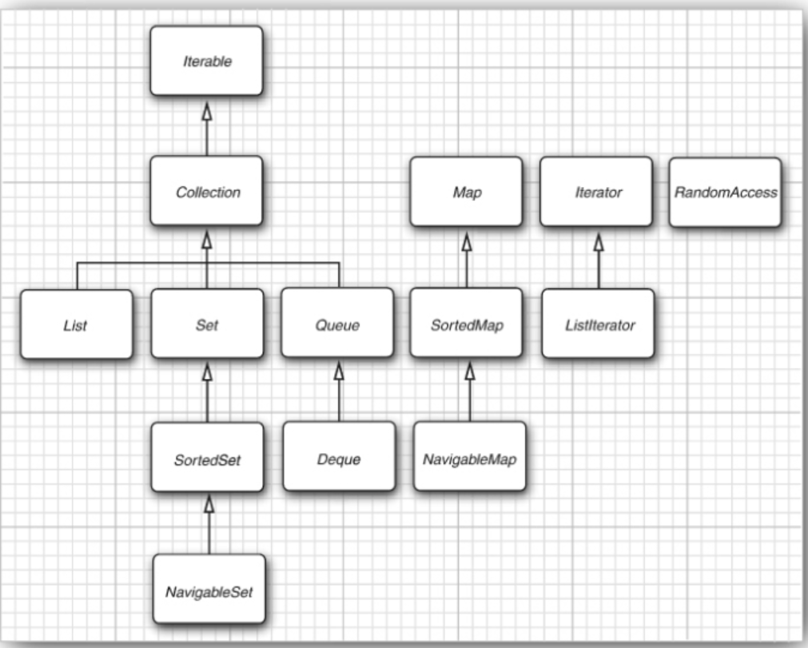
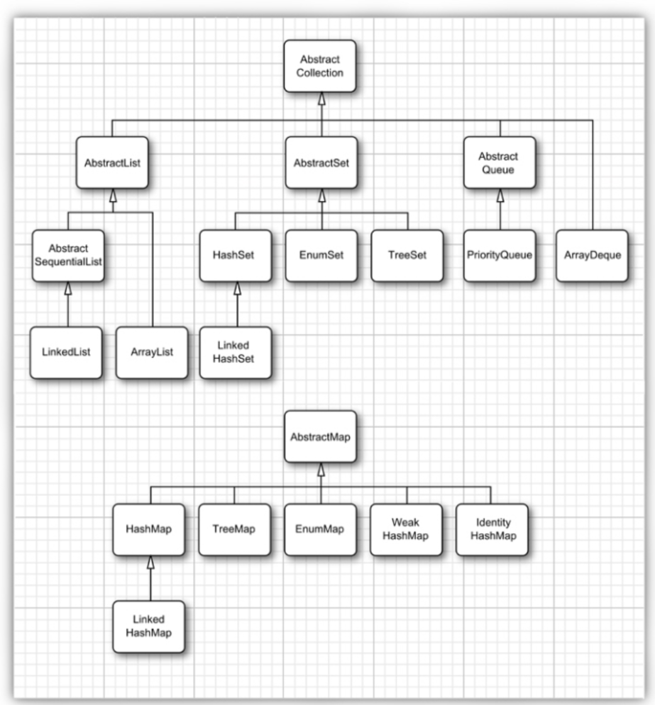

>[Home](Home.md)

# Chapter 9: Collections

## Status : IN_PROGRESS


- [Chapter 9: Collections](#chapter-9-collections)
  - [Status : IN\_PROGRESS](#status--in_progress)
  - [9.1 The Java Collections Framework](#91-the-java-collections-framework)
    - [9.1.1 Separating Collection Interfaces and Implementation](#911-separating-collection-interfaces-and-implementation)
    - [9.1.2 The Collection Interface](#912-the-collection-interface)
    - [9.1.3 Iterators](#913-iterators)
    - [9.1.4 Generic Utility Methods](#914-generic-utility-methods)
  - [9.2 Interfaces in the Collections Framework](#92-interfaces-in-the-collections-framework)
  - [9.3 Concrete Collections](#93-concrete-collections)
    - [9.3.1 Linked Lists](#931-linked-lists)
    - [9.3.2 Array Lists](#932-array-lists)
    - [9.3.3 Hash Sets](#933-hash-sets)
    - [9.3.4 Tree Sets](#934-tree-sets)
    - [9.3.5 Queues and Deques](#935-queues-and-deques)
    - [9.3.6 Priority Queues](#936-priority-queues)
  - [9.4 Maps](#94-maps)
    - [9.4.1 Basic Map Operations](#941-basic-map-operations)
    - [9.4.2 Updating Map Entries](#942-updating-map-entries)
    - [9.4.3 Map Views](#943-map-views)
    - [9.4.4 Weak Hash Maps](#944-weak-hash-maps)
    - [9.4.5 Linked Hash Sets and Maps](#945-linked-hash-sets-and-maps)
    - [9.4.6 Enumeration Sets and Maps](#946-enumeration-sets-and-maps)
    - [9.4.7 Identity Hash Maps](#947-identity-hash-maps)
  - [9.5 Copies and Views](#95-copies-and-views)
    - [9.5.1 Small Collections](#951-small-collections)
    - [9.5.2 Unmodifiable Copies and Views](#952-unmodifiable-copies-and-views)
    - [9.5.3 Subranges](#953-subranges)
    - [9.5.4 Checked Views](#954-checked-views)
    - [9.5.5 Synchronized Views](#955-synchronized-views)
    - [9.5.6 A Note on Optional Operations](#956-a-note-on-optional-operations)
  - [9.6 Algorithms](#96-algorithms)
    - [9.6.1 Why Generic Algorithms?](#961-why-generic-algorithms)
    - [9.6.2 Sorting and Shuffling](#962-sorting-and-shuffling)
    - [9.6.3 Binary Search](#963-binary-search)
    - [9.6.4 Simple Algorithms](#964-simple-algorithms)
    - [9.6.5 Bulk Operations](#965-bulk-operations)
    - [9.6.6 Converting between Collections and Arrays](#966-converting-between-collections-and-arrays)
    - [9.6.7 Writing Your Own Algorithms](#967-writing-your-own-algorithms)
  - [9.7 Legacy Collections](#97-legacy-collections)
    - [9.7.1 The Hashtable Class](#971-the-hashtable-class)
    - [9.7.2 Enumerations](#972-enumerations)
    - [9.7.3 Property Maps](#973-property-maps)
    - [9.7.4 Stacks](#974-stacks)
    - [9.7.5 Bit Sets](#975-bit-sets)


## 9.1 The Java Collections Framework

### 9.1.1 Separating Collection Interfaces and Implementation

> As is common with modern data structure libraries, the Java collection library separates interfaces and implementations.

### 9.1.2 The Collection Interface

[Collection API doc](https://docs.oracle.com/en/java/javase/17/docs/api/java.base/java/util/Collection.html)

> The fundamental interface for collection classes in the Java library is the Collection interface. The interface has two fundamental methods: (there are others as well)

```java
public interface Collection<E>
{
   boolean add(E element);  //returns true if the collection changed
   Iterator<E> iterator();  // returns an iterator for the collection
   . . . (other methods omitted)
}

```

### 9.1.3 Iterators

[Iterator API doc](https://docs.oracle.com/en/java/javase/17/docs/api/java.base/java/util/Iterator.html)

Are used to visit all elements of a collection.


> The Iterator interface has four methods:

```java
public interface Iterator<E>
{   E next();
   boolean hasNext();  // call this before calling next()
   void remove();
   default void forEachRemaining(Consumer<? super E> action);
}
```

Using an iterator

```java
Collection<String> c = . . . ;
Iterator<String> iter = c.iterator();
// this check is necessary 
// as calling next() can throw NoSuchElementException

while (iter.hasNext())
{  String s = iter.next();
       . . . do something with s
}
```
Can also use a for-each loop

```java
for (String s : c)
       . . . do something with s
```

It can be used on any collection as Collection implements Iterable interface.

```java
public interface Iterable<T>
{
  Iterator<T> iterator();
}
```

You can think of iterators being in between elements.

> think of Java iterators as being between elements. When you call next, the iterator jumps over the next element, and it returns a reference to the element

[AdvancingAnIterator](../assets/diagrams/AdvancingAnIterator.excalidraw)
[AdvancingAnIterator PNG](../assets/diagrams/AdvancingAnIterator.png)

[IteratorTest](../book-code/corejava/v1ch09/pawarv/IteratorTest.java)

>The remove method of the Iterator interface removes the element that was returned by the last call to next.


### 9.1.4 Generic Utility Methods


> The Collection and Iterator interfaces are generic, which means you can write utility methods that operate on any kind of collection.
>
> In fact, the Collection interface declares quite a few useful methods that all implementing classes must supply. Among them are 
> * int size() 
> * boolean isEmpty() 
> * boolean contains(Object obj) 
> * boolean containsAll(Collection<?> c) 
> * boolean equals(Object other) 
> * boolean addAll(Collection<? extends E> from) 
> * boolean remove(Object obj) 
> * boolean removeAll(Collection<?> c) 
> * void clear() 
> * boolean retainAll(Collection<?> c) Object[] toArray()


> To make life easier for implementors, the library supplies a class AbstractCollection that leaves the fundamental methods size and iterator abstract but implements the routine methods in terms of them. 
> This approach is a bit outdated. It would be nicer if the methods were default methods of the Collection interface.

The default method `removeIf` has been added to Collection. See [PredicateAndTest](../book-code/corejava/v1ch06/pawarv/PredicateAndTest.java)

[GenericUtilityMethodsTest](../book-code/corejava/v1ch09/pawarv/GenericUtilityMethodsTest.java)
## 9.2 Interfaces in the Collections Framework


[Collection Hierarchy](https://upload.wikimedia.org/wikipedia/commons/a/ab/Java.util.Collection_hierarchy.svg) 

[Collection Hierrachy Local file](../assets/diagrams/Java.util.Collection_hierarchy.svg)

[Map Hierarchy](https://upload.wikimedia.org/wikipedia/commons/7/7b/Java.util.Map_hierarchy.svg)
[Map Hierarchy Local](../assets/diagrams/Java.util.Map_hierarchy.svg)

> There are two fundamental interfaces for collections: Collection and Map .

Add into a list using `boolean add(E element)` and get values using `E get(int index)` or visit them using an iterator.

Add into a Map using `V put(K key, V value)`, and read values using `V get(K key)`.

A List is an ordered collection.

## 9.3 Concrete Collections


### 9.3.1 Linked Lists

[LinkedListTest](../book-code/corejava/v1ch09/linkedList/LinkedListTest.java)

### 9.3.2 Array Lists

[ArrayListTest](../book-code/corejava/v1ch09/pawarv/ArrayListTest.java)

[UnmodifiableCollectionsTest](../book-code/corejava/v1ch09/pawarv/UnmodifiableCollectionsTest.java)


### 9.3.3 Hash Sets
>  If you don’t care about the ordering of the elements, there are data structures that let you find elements much faster.

> A well-known data structure for finding objects quickly is the hash table. A hash table computes an integer, called the hash code, for each object. A hash code is somehow derived from the instance fields of an object, preferably in such a way that objects with different data yield different codes.

>  A set is a collection of elements without duplicates.

[HashSetTest](../book-code/corejava/v1ch09/pawarv/HashSetTest.java)

[SetTest](../book-code/corejava/v1ch09/set/SetTest.java)

### 9.3.4 Tree Sets
### 9.3.5 Queues and Deques
### 9.3.6 Priority Queues
## 9.4 Maps

[MapTest](../book-code/corejava/v1ch09/pawarv/MapTest.java)
### 9.4.1 Basic Map Operations
### 9.4.2 Updating Map Entries
### 9.4.3 Map Views
### 9.4.4 Weak Hash Maps
### 9.4.5 Linked Hash Sets and Maps
### 9.4.6 Enumeration Sets and Maps
### 9.4.7 Identity Hash Maps
## 9.5 Copies and Views
### 9.5.1 Small Collections
### 9.5.2 Unmodifiable Copies and Views
### 9.5.3 Subranges
### 9.5.4 Checked Views
### 9.5.5 Synchronized Views
### 9.5.6 A Note on Optional Operations
## 9.6 Algorithms
### 9.6.1 Why Generic Algorithms?
### 9.6.2 Sorting and Shuffling
### 9.6.3 Binary Search
### 9.6.4 Simple Algorithms
### 9.6.5 Bulk Operations
### 9.6.6 Converting between Collections and Arrays
### 9.6.7 Writing Your Own Algorithms
## 9.7 Legacy Collections
### 9.7.1 The Hashtable Class
### 9.7.2 Enumerations
### 9.7.3 Property Maps
### 9.7.4 Stacks
### 9.7.5 Bit Sets

>[Home](HOME.md)
