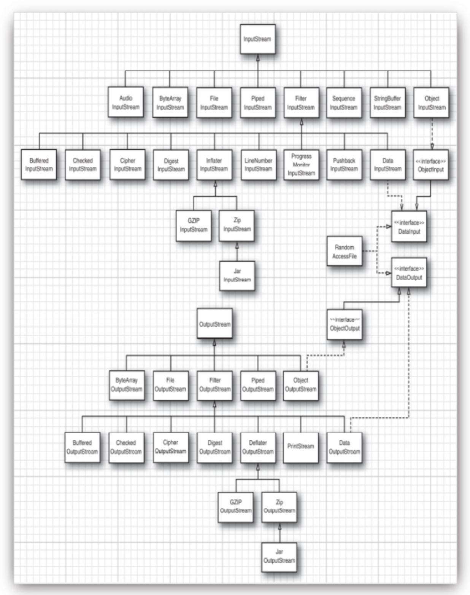
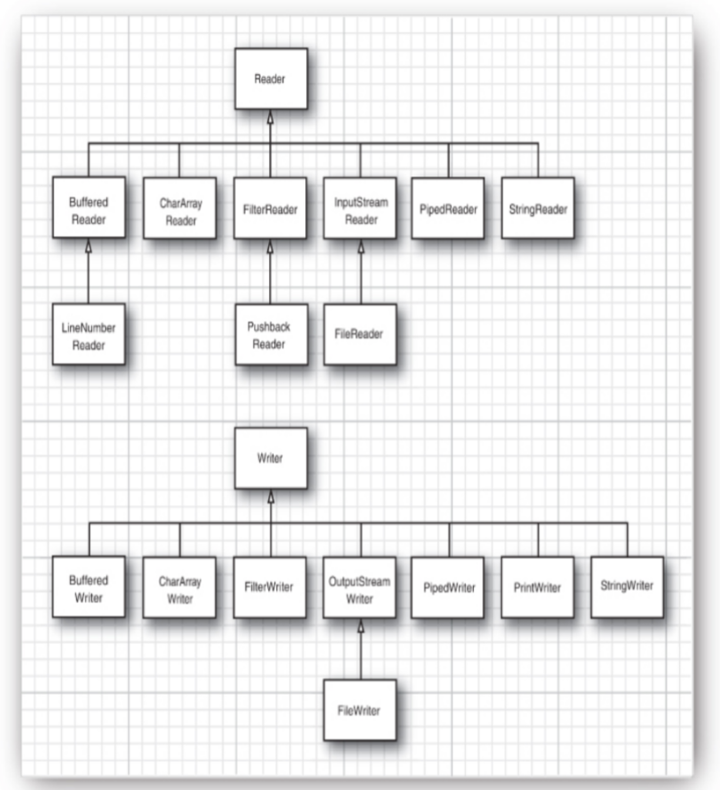
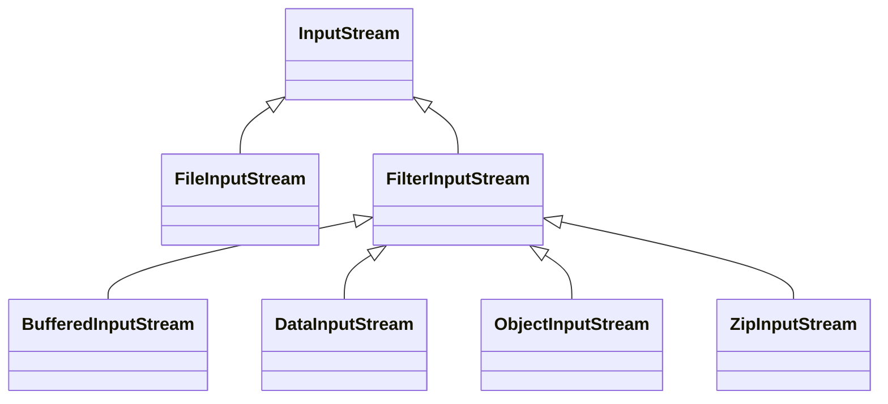
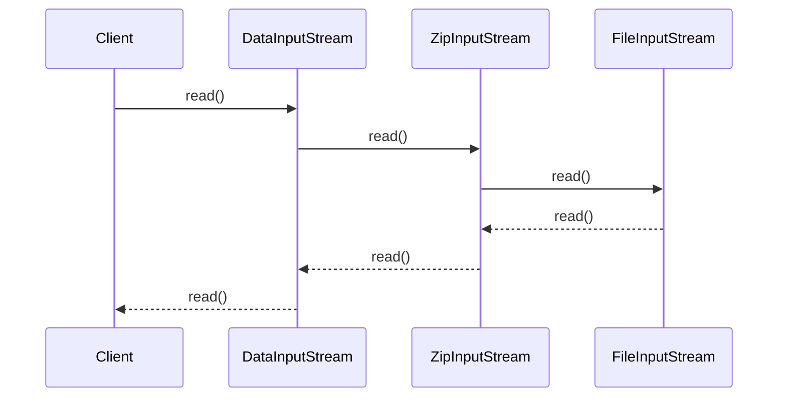

> [Home](Home.md)

# Volume 2 Chapter 2: Input and Output

Status : IN_PROGRESS

We'll look into

- Read and write data to files
- Access files and directories
- Read binary and text formatted files
- Object serialization
- Regular expressions

## 2.1 Input/Output Streams

### Introduction

In Java I/O, a stream is a sequence of bytes. Note that these streams are not the same as the Streams that are in the package java.util.stream which are used for functional programming. Unfortunately, the Java API uses the same name for both.

Input streams read data from a source, and output streams write data to a destination.

To read and write text data (Unicode), we can use the `Reader` and `Writer` classes. These classes are abstract classes that define the basic input and output operations.

The source and destination can be a file, an array, a device, or a network connection. The Java I/O API defines a large number of stream classes, and it is easy to get lost in the jungle of classes. The following table lists the most important stream classes.

| Class                 | Description                                                                 |
| --------------------- | --------------------------------------------------------------------------- |
| InputStream           | Abstract superclass for all input streams                                   |
| OutputStream          | Abstract superclass for all output streams                                  |
| Reader                | Abstract superclass for all character-based input streams                   |
| Writer                | Abstract superclass for all character-based output streams                  |
| FileInputStream       | Reads raw bytes from a file                                                 |
| FileOutputStream      | Writes raw bytes to a file                                                  |
| FileReader            | Reads characters from a file                                                |
| FileWriter            | Writes characters to a file                                                 |
| ByteArrayInputStream  | Reads raw bytes from an array                                               |
| ByteArrayOutputStream | Writes raw bytes to an array                                                |
| CharArrayReader       | Reads characters from an array                                              |
| CharArrayWriter       | Writes characters to an array                                               |
| StringReader          | Reads characters from a string                                              |
| StringWriter          | Writes characters to a string                                               |
| PipedInputStream      | Reads raw bytes from a pipe                                                 |
| PipedOutputStream     | Writes raw bytes to a pipe                                                  |
| PipedReader           | Reads characters from a pipe                                                |
| PipedWriter           | Writes characters to a pipe                                                 |
| ObjectInputStream     | Reads objects from a stream                                                 |
| ObjectOutputStream    | Writes objects to a stream                                                  |
| DataInputStream       | Reads primitive data types from a stream                                    |
| DataOutputStream      | Writes primitive data types to a stream                                     |
| BufferedInputStream   | Adds buffering to an input stream                                           |
| BufferedOutputStream  | Adds buffering to an output stream                                          |
| BufferedReader        | Adds buffering and line-oriented reading to a character-based input stream  |
| BufferedWriter        | Adds buffering and line-oriented writing to a character-based output stream |
| PrintStream           | Writes formatted data to an output stream                                   |
| PrintWriter           | Writes formatted data to a character-based output stream                    |

### 2.1.1 Reading and Writing Bytes

- [ReadingAndWritingBytesTest](../book-code/corejava/v2ch02/pawarv/ReadingAndWritingBytesTest.java)
- This ascii table shows the byte values of the characters.

This is a table of the first 128 characters in the Unicode character set. The first 32 characters are control characters that are not printable. The next 96 characters are printable ASCII characters. The last 32 characters are control characters that are not printable.

| Character | Decimal | Hexadecimal | Octal | Binary |
| --------- | ------- | ----------- | ----- | ------ |
| NUL       | 0       | 0x00        | 000   | 000000 |
| space     | 32      | 0x20        | 040   | 010000 |
| LF        | 10      | 0x0A        | 012   | 000010 |
| CR        | 13      | 0x0D        | 015   | 000011 |
| A         | 65      | 0x41        | 101   | 100000 |
| a         | 97      | 0x61        | 141   | 110000 |
| #         | 35      | 0x23        | 043   | 010011 |
| $         | 36      | 0x24        | 044   | 010100 |
| 1         | 49      | 0x31        | 061   | 011001 |

This is a table of Unicode characters that are not in the first 128 characters. T

| Character | Decimal | Hexadecimal | Octal   | Binary         |
| --------- | ------- | ----------- | ------- | -------------- |
| €         | 8364    | 0x20AC      | 0202540 | 10000010101100 |
| £         | 163     | 0x00A3      | 0020033 | 00000010000011 |
| ¥         | 165     | 0x00A5      | 0020035 | 00000010000101 |
| ₹         | 8377    | 0x20B9      | 0202551 | 10000010111001 |
| ₩         | 8361    | 0x20A9      | 0202541 | 10000010101101 |

This is a table of Unicode characters.
Unicode is a code point, which is a number that identifies a character.
UTF-8 is a variable-length encoding of Unicode characters.
UTF-16 is a fixed-length encoding of Unicode characters.
UTF-8 decimal is the decimal representation of the UTF-8 bytes.
UTF-16 decimal is the decimal representation of the UTF-16 bytes.

| Character | Unicode | UTF-8          | UTF-16 | UTF-8 decimal | UTF-16 decimal |
| --------- | ------- | -------------- | ------ | ------------- | -------------- |
| NUL       | U+0000  | 0x00           | 0x0000 | 0             | 0              |
| space     | U+0020  | 0x20           | 0x0020 | 32            | 32             |
| LF        | U+000A  | 0x0A           | 0x000A | 10            | 10             |
| CR        | U+000D  | 0x0D           | 0x000D | 13            | 13             |
| A         | U+0041  | 0x41           | 0x0041 | 65            | 65             |
| ¥         | U+00A5  | 0xC2 0xA5      | 0x00A5 | 194 165       | 165            |
| €         | U+20AC  | 0xE2 0x82 0xAC | 0x20AC | 226 130 172   | 8364           |
| ₹         | U+20B9  | 0xE2 0x82 0xB9 | 0x20B9 | 226 130 185   | 8377           |
| ₩         | U+20A9  | 0xE2 0x82 0xA9 | 0x20A9 | 226 130 169   | 8361           |

The InputStream and OutputStream classes are abstract classes that define the basic input and output operations. The InputStream class defines the following methods:

| Method             | Description                                                                                                                |
| ------------------ | -------------------------------------------------------------------------------------------------------------------------- |
| int read()         | Reads a single byte. Returns -1 if the end of the stream has been reached.                                                 |
| int read(byte[] b) | Reads a sequence of bytes into an array. Returns the number of bytes read or -1 if the end of the stream has been reached. |
| void close()       | Closes the stream.                                                                                                         |

The OutputStream class defines the following methods:

| Method               | Description                               |
| -------------------- | ----------------------------------------- |
| void write(int b)    | Writes a single byte.                     |
| void write(byte[] b) | Writes a sequence of bytes from an array. |
| void close()         | Closes the stream.                        |

### 2.1.2 The Complete Stream Zoo

Bytes class hierarchy is different from character class hierarchy.

**Input and output stream hierarchy**


**Character stream hierarchy**


### 2.1.3 Combining Input/Output Stream Filters

The subclasses of FilterInputStream and FilterOutputStream are called stream filters. They are used to modify the behaviour of the underlying stream.

This is done by chaining the filters together.

For example, the BufferedInputStream class adds buffering to an input stream. The DataInputStream class adds methods for reading Java primitive types. These classes which are subclasses of FilterInputStream can be chained together to add both buffering and data reading to an input stream.

The following diagram shows the class hierarchy of the input stream classes.



You can add those capabilities to an existing stream by wrapping it in a filter stream. For example, the following code adds buffering to a FileInputStream.

```java

var stream = new BufferedInputStream(
                new FileInputStream("myfile.txt"));

```

This following code adds buffering and data reading to a FileInputStream.

```java

var stream = new DataInputStream (
                new BufferedInputStream(
                    new FileInputStream("myfile.txt")));

```

This following code combines Zip and File input streams.

```java

var stream = new ZipInputStream (
                new FileInputStream("myfile.zip"));

```

The following combines DataInputStream, ZipInputStream, and FileInputStream.

```java

var stream = new DataInputStream (
                new ZipInputStream (
                    new FileInputStream("myfile.zip")));

```

The following diagram shows a sequence diagram of how the `read` method is called on the DataInputStream.



### 2.1.4 Text Input and Output

See

- [ReadingAndWritingCharacters](../book-code/corejava/v2ch02/pawarv/ReadingAndWritingCharacters.java)
- [TestInputAndOutputStreamReader](../book-code/corejava/v2ch02/pawarv/TestInputAndOutputStreamReader.java)

When saving data, there are two options: save the data in binary format or save the data in text format. Binary format is more compact, but it is not human-readable.

The InputStreamReader class converts bytes to characters. The OutputStreamWriter class converts characters to bytes. This is a bridge between byte streams and character streams. When saving text data, we have to consider the character encoding.

Both of these take Charset as an argument. By default, the Charset is UTF-8. However you can specify other character sets. Java internally uses UTF-16 for character encoding. Therefore, when you cast a character to an integer, you get the UTF-16 code point.

### 2.1.5 How to Write Text Output

We can use PrintWriter to write text to a file. The PrintWriter class is a character-based output stream that adds buffering and formatting capabilities to an output stream. The PrintWriter class defines the following methods:

| Method                                     | Description                           |
| ------------------------------------------ | ------------------------------------- |
| void print(String s)                       | Writes a string.                      |
| void println(String s)                     | Writes a string and a line separator. |
| void printf(String format, Object... args) | Writes a formatted string.            |

We can use `PrintWriter` as below. The `out` object has the same methods as `System.out`.

```java
    PrintWriter out = new PrintWriter("myfile.txt", "UTF-8");
    out.println("Hello, World!");
```

See [TextWriteTest](../book-code/corejava/v2ch02/pawarv/TextWriteTest.java)

We do not have to buffer the output. The `PrintWriter` class does it for us.
By default autoflush is disabled for `PrintWriter`. We can enable it by passing `true` as the second argument to the constructor.

- [TextWriteAutoFlushTrueTest](../book-code/corejava/v2ch02/pawarv/TextWriteAutoFlushTrueTest.java)

The Scanner class is a character-based input stream that adds buffering and tokenization capabilities to an input stream. The Scanner class defines the following methods:

| Method                | Description                             |
| --------------------- | --------------------------------------- |
| boolean hasNext()     | Returns true if there is another token. |
| String next()         | Returns the next token.                 |
| String nextLine()     | Returns the next line.                  |
| int nextInt()         | Returns the next integer.               |
| double nextDouble()   | Returns the next double.                |
| boolean nextBoolean() | Returns the next boolean.               |

### 2.1.6 How to Read Text Input

We can use the methods on `Files` to read text from a file. See
[TextReadUsingFilesTest](../book-code/corejava/v2ch02/pawarv/TextReadUsingFilesTest.java).

But it's better to use `Scanner` as it has more options to read text, like reading a line, reading an integer, reading a double, etc.

See [TextReadScannerTest](../book-code/corejava/v2ch02/pawarv/TextReadScannerTest.java)

In the early versions of Java, the BufferedReader class was the standard way to read text from a file. See [TextReadBufferedReaderTest](../book-code/corejava/v2ch02/pawarv/TextReadBufferedReaderTest.java)

### 2.1.7 Saving Objects in Text Format

See book example [TextFileTest](../book-code/corejava/v2ch02/textFile/TextFileTest.java)

### 2.1.8 Character Encodings

Character encodings are used to convert between characters and bytes. They are a way to represent characters in a computer using a fixed number of bits. For example, the ASCII character encoding uses 7 bits to represent each character. The Unicode character encoding uses 16 bits to represent each character. The UTF-8 character encoding uses 8 bits to represent each character. The UTF-16 character encoding uses 16 bits to represent each character.

The Java platform uses UTF-16 as the default character encoding. However, UTF-8 is more compact and is used more often.

See the examples from previous sections.

- [ReadingAndWritingBytesTest](../book-code/corejava/v2ch02/pawarv/ReadingAndWritingBytesTest.java)
- [ReadingAndWritingCharacters](../book-code/corejava/v2ch02/pawarv/ReadingAndWritingCharacters.java)

### 2.2 Reading and Writing Binary Data

See book examples (this came later)

- [RandomAccessTest](../book-code/corejava/v2ch02/randomAccess/RandomAccessTest.java)
- [DataIO](../book-code/corejava/v2ch02/randomAccess/DataIO.java)

### 2.2.1 The DataInput and DataOutput Interfaces

Use to read and write binary data.

See [DataIO](../book-code/corejava/v2ch02/randomAccess/DataIO.java)

### 2.2.2 Random-Access Files

Use to access a file at random locations.

See book example [RandomAccessTest](../book-code/corejava/v2ch02/randomAccess/RandomAccessTest.java)

### 2.2.3 ZIP Archives

Use to work with ZIP archives.

See book example [ZipTest](../book-code/corejava/v2ch02/zip/ZipTest.java)

### 2.3 Object Input/Output Streams and Serialization

Use to read and write objects.

See book example [ObjectInputStreamTest](../book-code/corejava/v2ch02/serial/ObjectStreamTest.java)

### 2.3.1 Saving and Loading Serializable Objects (later)

### 2.3.2 Understanding the Object Serialization File Format (later)

### 2.3.3 Modifying the Default Serialization Mechanism (later)

### 2.3.4 The readResolve and writeReplace Methods (later)

### 2.3.5 Versioning (later)

### 2.3.6 Using Serialization for Cloning (later)

### 2.3.7 Deserialization and Security (later)

## 2.4 Working with Files

You use `Path` and `Files` class to work with files. Do not use `File` which was used in the early versions of Java.

### 2.4.1 Paths

Path is an interface that represents a path to a file. It is a sequence of directory names and a file name. The `Paths` class defines the following methods:

| Method                                 | Description                                                             |
| -------------------------------------- | ----------------------------------------------------------------------- |
| Path get(String first, String... more) | Returns a path that is a concatenation of the given strings.            |
| Path get(URI uri)                      | Returns a path that is a URI.                                           |
| Path resolve(Path other)               | Returns a path that is a concatenation of this path and the given path. |

If it starts with a slash, it is an absolute path. If it starts with a drive letter, it is an absolute path. Otherwise, it is a relative path.

### 2.4.2 Reading and Writing Files

See [FilesTest](../book-code/corejava/v2ch02/pawarv/FilesTest.java)

Files provides the following methods:


| Method                                                                 | Description                                                                 |
| ---------------------------------------------------------------------- | --------------------------------------------------------------------------- |
| byte[] readAllBytes(Path path) throws IOException                       | Returns the contents of the file as a byte array.                           |
| List\<String\> readAllLines(Path path) throws IOException                 | Returns the contents of the file as a list of strings.                      |
| List\<String\> readAllLines(Path path, Charset cs) throws IOException     | Returns the contents of the file as a list of strings.                      |
| Stream\<String\> lines(Path path) throws IOException                        | Returns a stream of strings.                                                |
| String readString(Path path) throws IOException                         | Returns the contents of the file as a string.                               |
| String readString(Path path, Charset cs) throws IOException             | Returns the contents of the file as a string.                               |
| Path write(Path path, byte[] bytes, OpenOption... options) throws IOException | Writes a byte array to a file.                                              |
| Path write(Path path, Iterable<? extends CharSequence> lines, Charset cs, OpenOption... options) throws IOException | Writes a list of strings to a file. |
| Path write(Path path, Iterable<? extends CharSequence> lines, OpenOption... options) throws IOException | Writes a list of strings to a file. |
| Path writeString(Path path, CharSequence csq, OpenOption... options) throws IOException | Writes a string to a file. |

This saves you from having to create a `FileOutputStream` or `FileInputStream` or `FileReader` or `FileWriter`.


2.4.3 Creating Files and Directories

2.4.4 Copying, Moving, and Deleting Files

2.4.5 Getting File Information

2.4.6 Visiting Directory Entries

2.4.7 Using Directory Streams

2.4.8 ZIP File Systems

2.5 Memory-Mapped Files

2.5.1 Memory-Mapped File Performance

2.5.2 The Buffer Data Structure

2.6 File Locking

2.7 Regular Expressions

2.7.1 The Regular Expression Syntax

2.7.2 Matching an Entire String

2.7.3 Finding All Matches in a String

2.7.4 Groups

2.7.5 Splitting along Delimiters

2.7.6 Replacing Matches

2.7.7 Flags

> [Home](HOME.md)
